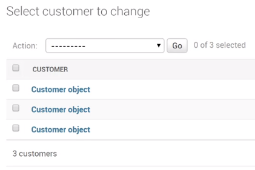
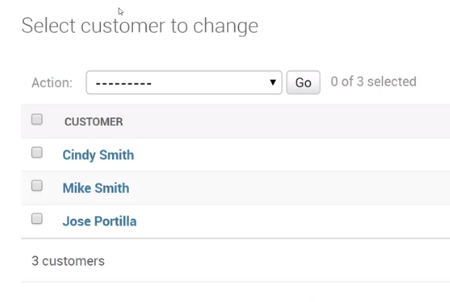

# Customizing ADMIN
1. Register models in admin.py
2. Make migrations
3. Create superuser
4. Add string representation to Models:
  ```
  class Customer(models.Model):
    first_name = models.CharField(max_length=256)
    last_name = models.CharField(max_length=256)

    def __str__(self):
      return self.first_name + ' ' + self.last_name
  ```
  * It will show customers in admin/ as First Name and Last Name instead of Customer object.
  * W/o string representation:  
  
  * With string representation:  
  

# ADMIN Templates
1. Create the directory structure and then find the template name from Github
2. Afterwards we can change the template however we want
3. templates/admin/
  - base.html
  - base_site.html
  - etc.
    * Copy & paste from django git html and edit locally


# Ordering Fields
1. By default the Admin will display fields in the detail view in the same order they are defined in the model
2. It can be changed with a few edits in the admin.py
  ```
  class MovieAdmin(admin.ModelAdmin):
    fields = ['release_year', 'title', 'length']

  admin.site.register(models.Movie,MovieAdmin)
  ```

# Adding Search
```
class MovieAdmin(admin.ModelAdmin):
  ...

  search_fields = ['title, length']
```

# Adding Filters
- Filters will automatically show up on the right hand side of the view
- They will also auto filter depending on the data type
- **Note:** Not every field will be useful as a filter

```
class MovieAdmin(admin.ModelAdmin):
  ...

  list_filter = ['release_year']
```


# Adding Fields
- Currently we only see one field of our models in the list view on the Admin page
- We can add in more fields to view and order by

```
class MovieAdmin(admin.ModelAdmin):
  ...

  list_display = ['title','release_year', 'length']
```
- In admin page, you can then sort data by fields

# Editable List View
- The ability to edit attribute values from the list view, instead of having to click into the detail view.
- **Note:** In order to edit list, you need to display it first

```
class MovieAdmin(admin.ModelAdmin):
  ...
  list_display = ['title','release_year', 'length']
  list_editable = ['length']
```
- **Note:** You should be cautious with this approach as if multiple people have access to admin page and this list you may cause problems if they're trying to edit the same attribute/field at the dame time
- Whoever clicked 'save' last ends up the final save
