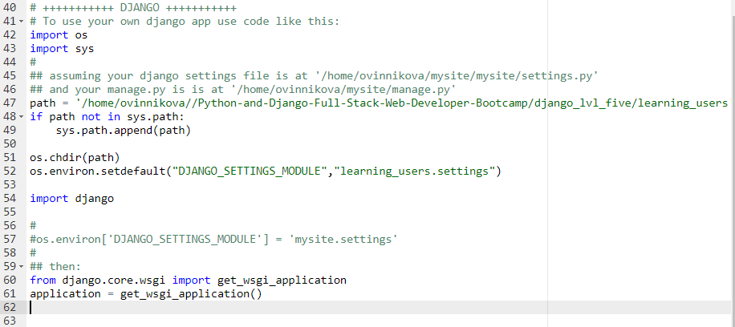
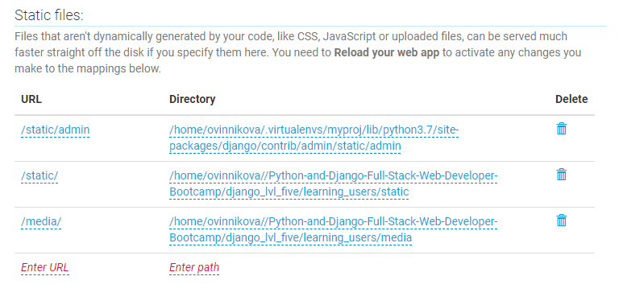

https://www.pythonanywhere.com
1. Set up a virtual environment
  * New Console -> Bash  
  ~ $ mkvirtualenv --python=python3.7 myproj  
  ~ $ pip list *- list of all packages already installed*  
  ~ $ pip install -U django==2.1.5  
  ~ $ which django-admin.py *- checks if installed successfully*  
2. Get a copy of our repo from github  
  ~ $ git clone https://github.com/REPO.git
3. clear *- this command will clear the console*
4. cd to project page and make migrations  
  ~ $ python manage.py migrate
  ~ $ python manage.py makemigrations basic_app
  ~ $ python manage.py migrate  
5. create a superuser  
~ $ python manage.py createsuperuser
6. Go to Dashboard -> Web -> Manual Configuration
7. WEB APP SETUP:
  * virtualenv - /home/username/.virtualenvs/myproj
  * source code - (if forgot, run **pwd** in bash console in a proj folder)
  * edit wsgi.py
    * delete hello world
    * add this:  
    

  * in settings: ```ALLOWED_HOSTS = ['username.pythonanywhere.com']```
  * edit static:  
  
  * turn debug off in settings
