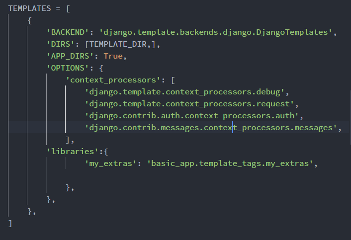
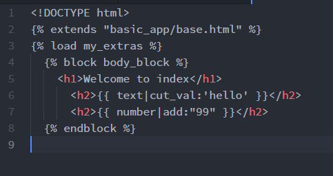

## Relative URLs with Templates
- Hardcoded path to the file is a poor practice if you want the Django proj to work on any system.
- Inside the urls.py you add in the variable **app_name** equal to a string that is the same as your app name
* <a href="basicapp/thankyou">Thanks</a>
* Can be changed to:
* <a href="">Thanks</a>

### Django Template Inheritance
- TI allows to create a base template we can inherit from
- The inheritance doesn't need to be limited to one base.html file, you can extend multiple templates
- Steps for inheritance:
  * Find repetitive parts of your project
  * Create a base template of them
  * Set the tags in the base template
  * Extend and call those tags anywhere

### Template Filters and Custom Filters
- Help making edits to the information from model before injecting it (string operations, arithmetic, etc.)
- The general form for a template filter is:  
{{ value | filter:"parameter"}}
- Not all filters take in parameters
- Many of these filters are based off of common built-in Python functions (docs)
- When we create your own filter, at the top of your template/html file, you need to add a load call:
  * 
  * add template to libraries inside settings:
    * 
    * 
