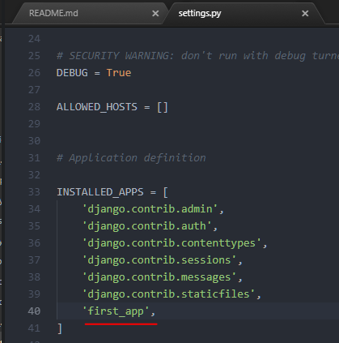

1. We use **Anaconda** and **conda** for virtual environment.
```
conda create --name myDjangoEnv django
```
Downloads the latest django and applies it to the virtual environment
(Or create with Anaconda Navigator)

2. Activating:
```
activate myDjangoEnv
```

3. Deactivating:
```
deactivate
```

4. List of ENVs:
```
conda info --envs
```

5. Installing django:
```
pip install django
```

6. Info:
https://conda.io

7. Creating proj:
```
django-admin startproject first_project
```

8. Files in a proj:
- __init.py__

Blank py script that due to its special name let's Python know that
this directory can be treated as a package.


- settings.py

Project settings


- urls.py

Store all the URL patterns for the proj. (Basically: different pages of
a web app) This particular file is going to make a lot of use of regex.


- wsgi.py

Acts as the Web Server Gateway Interface. It will later on help us deploy
our web app to prod


- manage.py

Will use a lot.


9. Running Local Server
```
python manage.py runserver
```


10. MIGRATIONS!
Migration allows to move DB from one design to another, this is
also reversible.


11. Django Project - a collection of applications and configurations that
when combined together will make up the full web app.

12. Django Application - is created to perform a particular functionality
for your entire web app.
These Django Apps can then be plugged into other Django Projects, so you
can reuse them.

- Creating an app:
```
python manage.py startapp first_app
```

13. Files in app:
- __init.py__

Blank py script that due to its special name let's Python know that
this directory can be treated as a package.


- admin.py

You can register your models here which Django will then use them with
Django's admin interface.


- apps.py

Application specific configurations


- models.py

Application's data models. It's where you specify the entities and
relationships between the data.


- tests.py

Test functions to test code.


- views.py

Functions that handle requests and return responses.


- migrations (folder)

This dir stores DB specific info as it relates to the models.  

**views.py** and **models.py** are two files you're going to be using for any given app.


### STEPS FOR Creating an app:
1. Telling Django that we have an application.
first_project \ settings.py
We need to add our own application to **INSTALLED_APPS**   


2. Creating a view
first_app \ views.py

3. Map VIEW to URL
first_project \ urls.py
In order for us to see a view when we're running our server.

- URL MAPPING:
