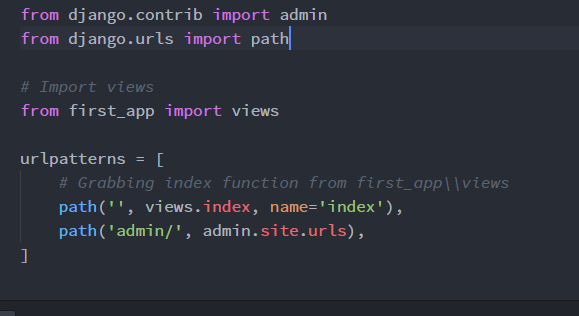

1. We use **Anaconda** and **conda** for virtual environment.
```
conda create --name myDjangoEnv django
```
Downloads the latest django and applies it to the virtual environment
(Or create with Anaconda Navigator)

2. Activating: (**!! IN CMD,** not PowerShell for Win)
```
activate myDjangoEnv
```

3. Deactivating:
```
deactivate
```

4. List of ENVs:
```
conda info --envs
```

5. Installing django:
```
pip install django
```

6. Info:
https://conda.io

7. Creating proj:
```
django-admin startproject first_project
```

8. Files in a proj:
- __init.py__  
Blank py script that due to its special name let's Python know that
this directory can be treated as a package.

- settings.py  
Project settings

- urls.py  
Store all the URL patterns for the proj. (Basically: different pages of
a web app) This particular file is going to make a lot of use of regex.

- wsgi.py  
Acts as the Web Server Gateway Interface. It will later on help us deploy
our web app to prod

- manage.py  
Will use a lot.


9. Running Local Server
```
python manage.py runserver
```


10. MIGRATIONS!
Migration allows to move DB from one design to another, this is
also reversible.


11. Django Project - a collection of applications and configurations that
when combined together will make up the full web app.

12. Django Application - is created to perform a particular functionality
for your entire web app.
These Django Apps can then be plugged into other Django Projects, so you
can reuse them.

- Creating an app:
```
python manage.py startapp first_app
```

13. Files in app:
- __init.py__  
Blank py script that due to its special name let's Python know that
this directory can be treated as a package.

- admin.py  
You can register your models here which Django will then use them with
Django's admin interface.

- apps.py  
Application specific configurations

- models.py  
Application's data models. It's where you specify the entities and
relationships between the data.

- tests.py  
Test functions to test code.

- views.py  
Functions that handle requests and return responses.

- migrations (folder)  
This dir stores DB specific info as it relates to the models.  

**views.py** and **models.py** are two files you're going to be using for any given app.


## STEPS FOR Creating an app:
1. Telling Django that we have an application.
first_project \ settings.py
We need to add our own application to **INSTALLED_APPS**   


2. Creating a view
first_app \ views.py  


3. Map VIEW to URL
first_project \ urls.py  

In order for us to see a view when we're running our server.

### URL MAPPING:
- include() function  
first_project \ urls.py  
allows to look for a match with regex and link back to our app's own urls.py file.  

We want to try to keep our project's urls.py clean and modular.  
We set the reference to the app, instead of listing them all in the main urls.  

4. Creating URLs inside of app
first_app \ urls.py
We create manually a new urls.py file
So, the applications can have their own urls.py

### JANGO TEMPLATES:
- Templates are a key part to understanding how Django really works and interacts
with your website.
- Template will contain the static parts of an html page (parts that are always the same,  
  they can be thought of as the scaffolding or skeleton of the page)
- Will also contain template tags, their syntax allows you to inject dynamic content  
that your Django App's views will produce, effecting the final HTML.

1. Create a templates directory and then a subdirectory for each specific app's templates
- It goes inside of your top level directory:
  * first_project/templates/first_app

2. Letting Django know of the templates by editing the DIR key inside of the TEMPLATES
dictionary in the settings.py  
- **Before** we should make our project easily transferrable between computers  
  * We will be using Python's os module to dynamically generate the correct file
  path strings, regardless of computer  
    
  

3. After it we can create an html file called index.html inside of the templates/first_app dir
-   templates/first_app/index.html
- Inside the html file we will insert template tags (Django Template Variable)
- Template variables will allow us to inject content into the HTML directly from Django ->  
  meaning we can later on use Python code to inject content from a database

4. Using render() into index() (views.py)
first_app \ views.py

