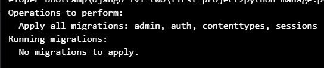
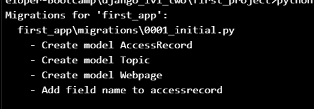
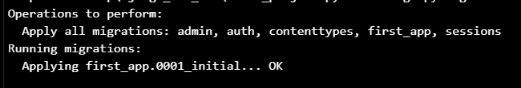
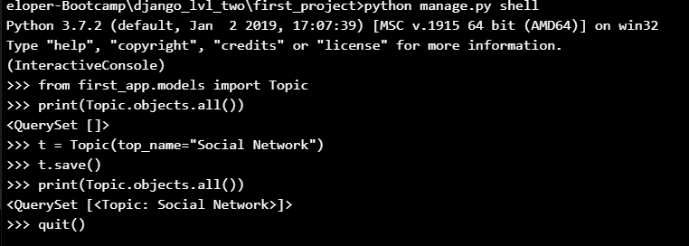

# Models
An essential part of any website is the **ability to accept information** from a user
and **input it into a DB** and **retrieve information** from a DB and **use it to generate**
content for the user.

- We use **Models** to incorporate a DB into a Django Project.
- Django comes equipped with **SQLite**
- If don't want to use SQLite, you can edit the **ENGINE** parameter used for DB in the
settings.py
- To create an **actual model**, we use a class structure inside of the relevant applications
models.py file
- This class object will be a subclass of Django's built-in class django.db.models.Model  
(basically, you're going to inherit from it)
- Each attribute of the class represents a field, which is like a column name with constraints
in SQL.

## Model Class
```
class Topic(models.Model):
  top_name = models.CharField(max_length=264, unique=True)


class Webpage(models.Model):
  category = models.ForeignKey(Topic, on_delete=models.DO_NOTHING)
  name = models.CharField(max_length=264)
  url = models.URLField()

  def __str__(self):
    return self.name
```
- After we've set up the models we can migrate the DB
  * migration:
  ```
  python manage.py migrate
  ```  
  
  * register the changes to your app:
  ```
  python manage.py makemigrations app1
  ```  
  
  * migrate db one more time  
  

- In order to use Admin interface with the models, we need to register them to our
app's admin.py
```
from django.contrib import admin
from app.models import Model1, Model2
admin.site.register(Model1)
admin.site.register(Model1)
```
- Admin Interface is one of the key features of Django.
  * In order to fully use DB and the Admin, we'll need to create a superuser
  * ```
    python manage.py createsuperuser
    ```
  * provide name, email, pass

- After setting up the models, it's always a good idea to populate them with some
test data
- Library Faker + script  

## Creating Models
- first_app \ models.py
- Creating a SQL DB (Migrating)
- Confirming & Interacting with DB
  * ```
    python manage.py shell
    ```

  
- Register models (first_app \ admin.py)
- Create a superuser
- http://127.0.0.1:8000/admin
